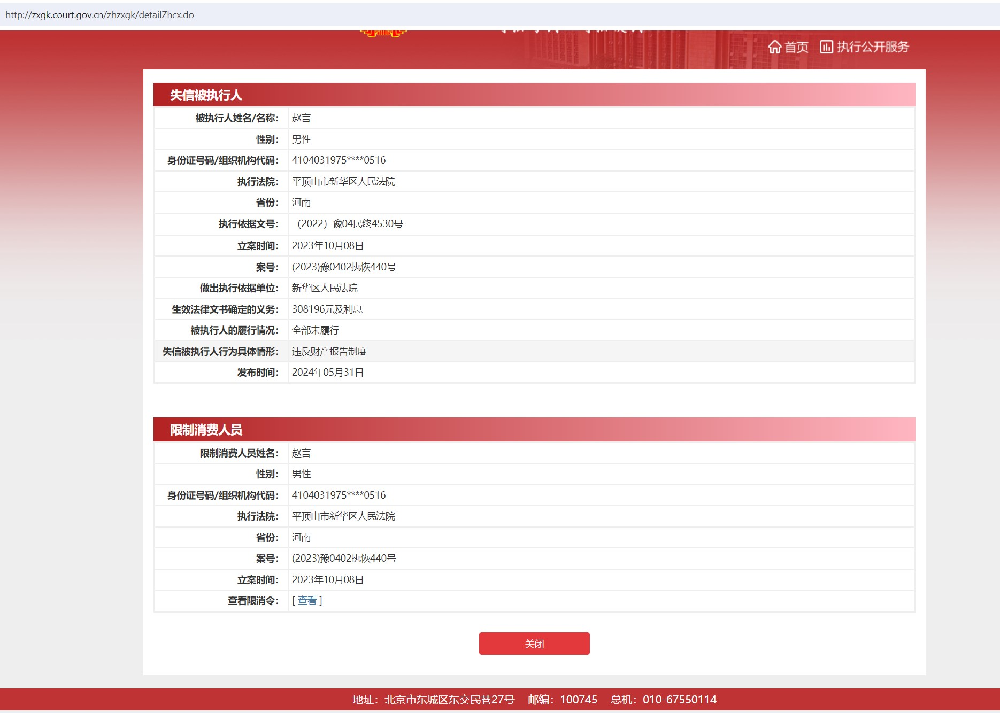
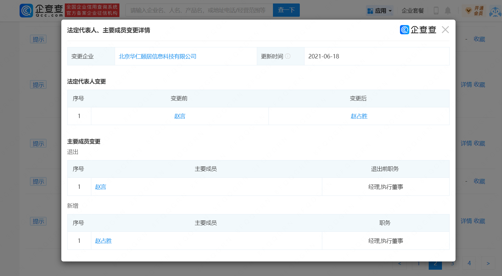
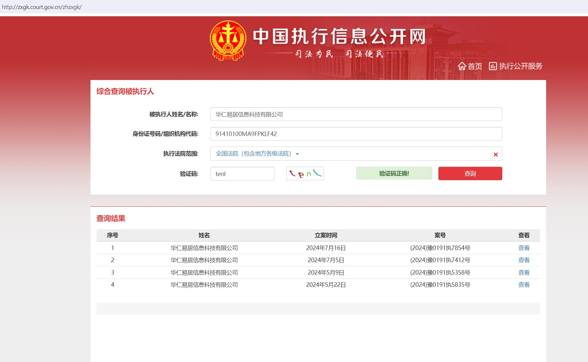
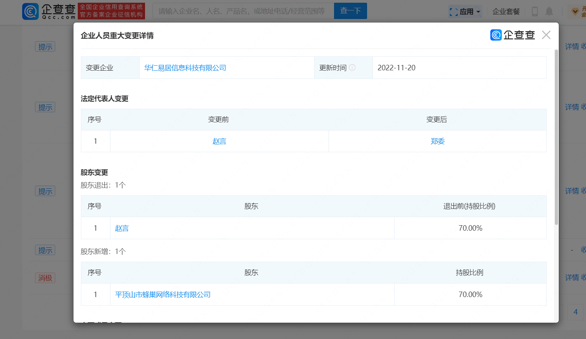
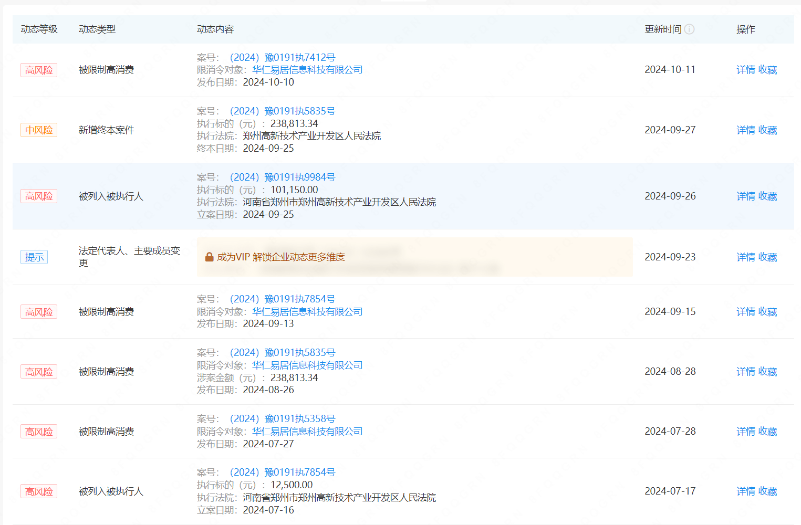
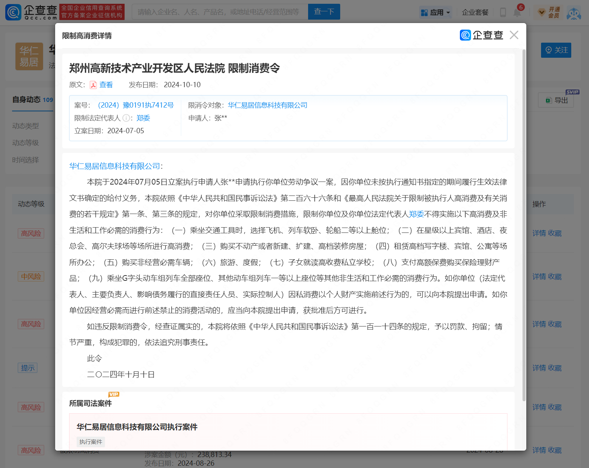

<h1>华人易居、华仁易居、赵言之内幕</h1>
**华人易居|华仁易居|赵言|诈骗|失信人|老赖|欠钱不还**

“华人易居”这个品牌背负了深深的罪恶，它吸了无数人的血，无数加盟商被割韭菜，无数员工离职时要不回辛辛苦苦挣的血汗钱，更有投资人也深受其害。

所有类似华人易居、华仁易居、华人管家、华人e家、华人易家、华人宿洁相关的公司背后实控人都为赵言，此人是一个毫无诚信可言的人！是一个无耻的大骗子。赵言曾经注册的公司大部分都已被列为被执行人，赵言名声败坏之后因无法再注册公司就骗自己的亲戚朋友用他们的身份继续注册新的公司来诈骗，一直在注册新公司来掩盖之前的罪行，这些公司背后实控人还是赵言，请大家擦亮双眼别被骗了。

**相关人员：**

赵言、赵战胜、郑委、郑江、杨亚东、刘晓、张一平、张慰微

以上都是他们诈骗团伙中的成员或帮凶。

赵言：被执行人、老赖，诈骗团伙头目。

赵战胜：被执行人、老赖，赵言的伯伯，年数已高，赵言把北京华仁颐居信息科技有限公司名声搞臭后把法人转移给了此人，做了替罪羔羊。

郑委：被执行人、已被限制高消费，赵言之小舅子，华仁易居信息科技有限公司法人（原法人为赵言），只是名义上的法人根本不在公司上班，为赵言洗钱用的。

郑江：赵言之小舅子，华人易居信息科技（上海）有限公司原法人，只是名义上的法人根本不在公司上班，为赵言洗钱用的。

杨亚东：华人易家（河南）信息科技有限公司法人，此公司为空壳公司，为赵言洗钱用的。

刘晓：被执行人、已被限制高消费，赵言为转移财产和逃避债务已与原妻技术性离婚，现与此人勾搭在一起，任公司总经理，刘为赵大学同学之妻，关系颇为混乱...

张一平：华人易居信息科技（上海）有限公司法人，刘晓之女，只是名义上的法人根本不在公司上班，为赵言洗钱用的。

张慰微：赵和刘的狗腿子，依仗公司的地位爱偷窃其它员工的劳动成果，无赖的小人，此人内心极为险恶，对不顺从他的同事各种打压，狗仗人势的东西。华仁宿度酒店管理有限公司法人，空壳公司，为赵洗钱用的。

**相关公司：**

华仁易居信息科技有限公司，北京华仁颐居信息科技有限公司，华人易居信息科技（上海）有限公司，华人易家（河南）信息科技有限公司，华仁宿度酒店管理有限公司，等

  <embed src="images/赵言-限消令-2310.pdf" type="application/pdf" width="100%" height="1000px">

  <embed src="images/赵言-限高令-2405.pdf" type="application/pdf" width="100%" height="1000px">

  <embed src="images/刘晓-限高令-1703.pdf" type="application/pdf" width="100%" height="1000px">

  <embed src="images/刘晓-限高令-1803.pdf" type="application/pdf" width="100%" height="1000px">

  <embed src="images/北京华仁颐居信息科技有限公司-限消令-1908.pdf" type="application/pdf" width="100%" height="1000px">

  <embed src="images/北京华仁颐居信息科技有限公司-限消令-2106.pdf" type="application/pdf" width="100%" height="1000px">

  <embed src="images/北京华仁颐居信息科技有限公司-限消令-2107.pdf" type="application/pdf" width="100%" height="1000px">

  <embed src="images/北京华仁颐居信息科技有限公司-限消令-2107_2.pdf" type="application/pdf" width="100%" height="1000px">

  <embed src="images/北京华仁颐居信息科技有限公司-限消令-2108.pdf" type="application/pdf" width="100%" height="1000px">

  <embed src="images/北京华仁颐居信息科技有限公司-限消令-2207.pdf" type="application/pdf" width="100%" height="1000px">

  <embed src="images/北京华仁颐居信息科技有限公司-限消令-2301.pdf" type="application/pdf" width="100%" height="1000px">

  <embed src="images/北京华仁颐居信息科技有限公司-限消令-2305.pdf" type="application/pdf" width="100%" height="1000px">

  <embed src="images/北京华仁颐居信息科技有限公司-限消令-2407.pdf" type="application/pdf" width="100%" height="1000px">

  <embed src="images/华仁易居信息科技有限公司-限消令-2405-1.pdf" type="application/pdf" width="100%" height="1000px">

  <embed src="images/华仁易居信息科技有限公司-限消令-2405-2.pdf" type="application/pdf" width="100%" height="1000px">

  <embed src="images/（2024）豫0191执7412号.pdf" type="application/pdf" width="100%" height="1000px">

